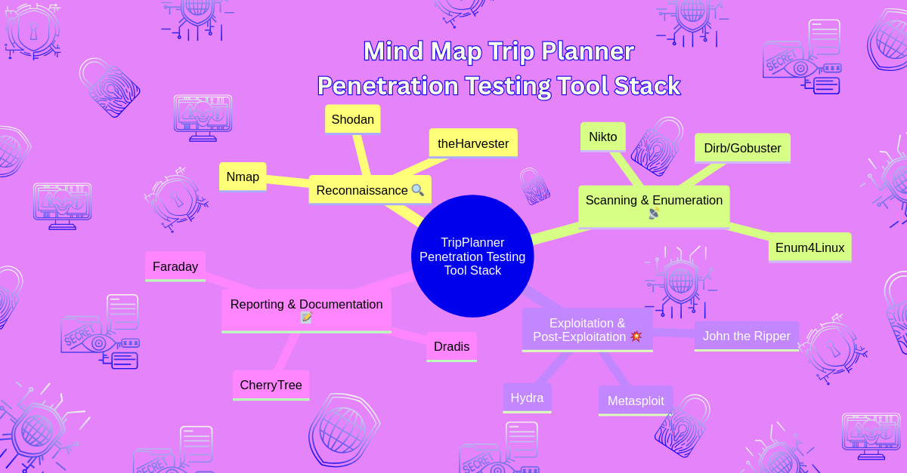

# 🛡️ Penetration Testing Series – Travel & Tourism Sector

This repository documents a simulated penetration testing series focused on a fictional travel planning web application: **TripPlanner**. The goal is to demonstrate core concepts of penetration testing through light case studies, practical tooling examples, and reporting artifacts — all aligned with professional methodologies.

## 🗺️ Scenario

**Target**: A web-based platform used for booking tours, hotels, and transportation across Europe.  
**Sector**: Travel & Tourism  
**Purpose**: Help the CTO assess vulnerabilities across user login, booking APIs, and admin dashboards.

---

## 🎯 Project Goals

- Practice structured penetration testing methodologies
- Explore OWASP Top 10 risks through hands-on demos
- Illustrate tooling per phase (Reconnaissance → Reporting)
- Create GitHub-friendly learning content
- Publish companion LinkedIn articles with simplified explanations

---

## 🧰 Tool Stack

This diagram visualizes tools used across different phases of the pentest: Reconnaissance, Scanning, Gaining Access, Maintaining Access, and Reporting.

---

## 📁 Reports & Findings

| File | Description |
|------|-------------|
| [`reports/tripplanner-penetration-summary.docx`]([penetration-testing-series-travel-sector/08-reporting-structure/reports/tripplanner-penetration-summary.docx](https://github.com/wis-beau/penetration-testing-series-travel-sector/blob/main/penetration-testing-series-travel-sector/08-reporting-structure/reports/tripplanner-penetration-summary.md) | Executive summary with scope, findings, and recommendations |
| [`reports/tripplanner-raw-findings.docx`]([penetration-testing-series-travel-sector/08-reporting-structure/reports/tripplanner-raw-findings.odt.docx](https://github.com/wis-beau/penetration-testing-series-travel-sector/blob/main/penetration-testing-series-travel-sector/08-reporting-structure/reports/tripplanner-raw-findings.md) | Technical raw findings organized by testing phase |

---

## 🚀 Usage Demos

Live usage notes and sample commands grouped by tool category:

- `usage-demos/nmap.md`
- `usage-demos/sqlmap.md`
- `usage-demos/nikto.md`
- `usage-demos/gobuster.md`
- `usage-demos/hydra.md`
- `usage-demos/burpsuite.md`
- `usage-demos/wireshark.md`
- `usage-demos/metasploit.md`

---

## 📂 Module Index (Penetration Testing Learning Series)

| Module # | Title                                      | Folder Link |
|----------|---------------------------------------------|-------------|
| 01       | Purpose & Objectives                        | [01-purpose-objectives/](penetration-testing-series-travel-sector/01-purpose-objectives) |
| 02       | Testing Types: Black, Gray, White Boxes     | [02-testing-types-black-gray-white/](penetration-testing-series-travel-sector/02-testing-types-black-gray-white) |
| 03       | OWASP Top 10 & Pen Testing                  | [03-owasp-top10/](penetration-testing-series-travel-sector/03-owasp-top10-and-pentesting) |
| 04       | Pen Testing Methodologies                   | [04-methodologies/](penetration-testing-series-travel-sector/04-pen-testing-methodologies) |
| 05       | Penetration Testing Phases                  | [05-Penetration Testing Phases/](penetration-testing-series-travel-sector/5 Pen Testing Phases) |
| 06       | Authorization & Safe Testing Practices      | [06-authorization-safety/](penetration-testing-series-travel-sector/06-authorization-safe-testing) |
| 07       | Penetration Testing Tools                   | [07-tools-overview/](penetration-testing-series-travel-sector/07-pen-testing-tools) |
| 08       | Penetration Testing Reporting Structure     | [08-reporting-structure/](https://github.com/wis-beau/penetration-testing-series-travel-sector/tree/main/penetration-testing-series-travel-sector/5%20Pen%20Testing%20Phases) |

---

## 🧠 Notes

- [`notes/cherry-notes-export.ctd`](penetration-testing-series-travel-sector/07-pen-testing-tools/usage-demos/cherrytree-notes.md.txt): export from CherryTree used for research tracking.

---

## 🖇️ Related LinkedIn Articles

Companion blog-style articles are published daily on LinkedIn to expand reach and engagement. [Link TBA]

---

## 🤝 Contributing

Pull requests are welcome to improve clarity, add more tools, or enhance reporting examples. Please open issues for suggestions.

---

## 📜 License

This project is released under the MIT License.
